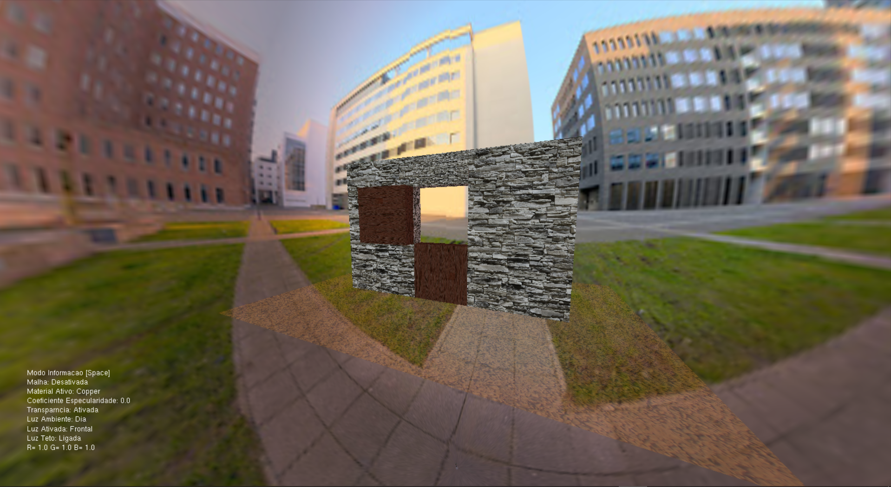
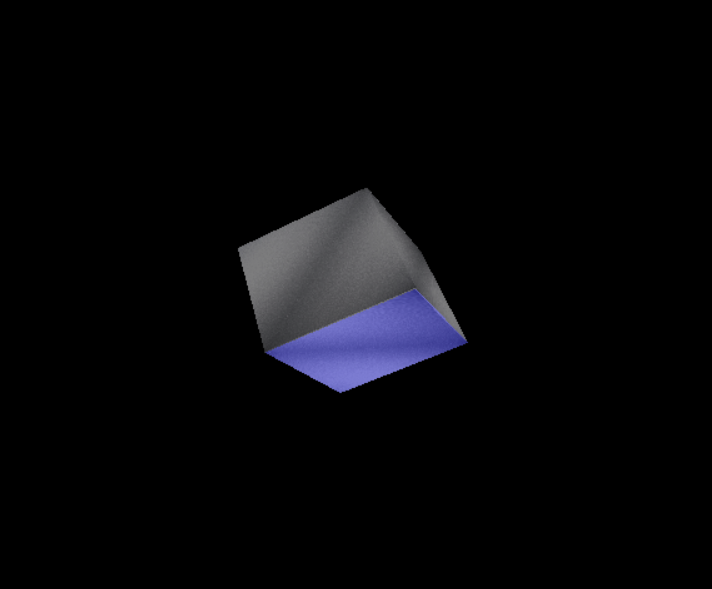

# Graphical Computation Assignment

___

## Used Technologies :computer:

1) **Microsoft Visual Studio 2019**

2) **OpenGL API (C++ language)**

3) **FreeGlut/Glut Libraries**

4) **Header Files stored in _Libraries_ folder**

___

## To Do :memo:

This project was subdivided in two different and independent steps.

- First Step:
    - Build a graphical ambient where I manually program concepts like:
        - **Objects Building**
        - **Visualization Projection**
        - **Animations**
        - **Illuminations**
        - **Textures**
        - **Transparency**
        - **Materials**
        
    - To concretize this step it was proposed to build a door. But, as I don't like usual doors, I decided to build a ***Futuristic Door***.

- Second Step:
    - Build a simple program just to take advantage of ***Vertex*** and ***Fragment Shaders***, applying same way some **Animation**, **Illumination**, **Textures** and **Transparency** concepts.
        #### What's a shader?
        Until now we've just seen code that runs in CPU, now, using shaders, we have coding runing in the graphics card.

        However, shaders aren't easy to program, debug or even fix, since they aren't such easily controlled.

        I used two different types of shaders:
        - `Fragment Shaders` Responsible of color and illumination present in all fragments belonging to a certain object.
        - `Vertex Shaders` Responsible of all vertex positions belonging to a certain object.

        So, what is the advantage using shaders? Mainly, performance! All those efforts compensates if the software runs faster! 

___     

## Step :one: - *Futuristic Door*

### Done :dart:

- `Objects Building`: 
    - 2 independent blocks acting like components of the door
    - 2 smaller blocks acting like buttons
    - 3 bigger blocks acting like wall
    - 1 horizontal surface acting like ground
    - 1 huge sphere acting like "world"
- `Visualization Projection`: 
    - Perspective, looking at the referential center.
- `Animations`: 
    - 90º Rotation of the upper door
    - Horizontal Translation of the lower door
    - Scaling of the buttons when automated opening/closing is done or being done
- `Illumination`: 
    - Ambient lighting (it kinda simulates day and night)
    - 2 lights are used: directional (behind the door) and a punctual (in front of the door) following [***Phong Reflection Model***](https://en.wikipedia.org/wiki/Phong_reflection_model), with independent colorations.
    - Each light contains 3 different Reflection components: ***Ambient***, ***Difuse*** and ***Specular***.

    
- `Textures`: 
    - All images were taken from *Google Images* and converted into ***bmp*** format.
    - 1 stone texture used in the wall
    - 1 wood texture used in the door and buttons
    - 1 gravel texture use in the floor surface
    - 1 city texture use in the ambient sphere
- `Transparency`: 
    - It can be turned on/off, affecting only the **floor** and the **buttons**
- `Materials`
    - Affects once again the **floor** and the **buttons**
    - Can be changed within a range of **18** different materials
    - It is accessed from *materials.h* file present in *Libraries* folder

### Interactions Allowed :busts_in_silhouette:
    - Tutorial/Info Mode [Space]
    - Zoom [Z/X]
    - Move Upper Door Manually [Q/W] and Automatically [E]
    - Move Lower Door Manually [A/S] and Automatically [D]
    - Turn on/off Transparency [K]
    - Change Lights' Components [R/G/B]
    - Change Lights' Intensities [T/L]
    - Change Floor Mesh [J/O/P]
    - Change Floor and Buttons' Materials [M]
    - Change Floor and Buttons' Specular Coeficient [I]

___

## Step :two: - *Windows 2000*

### Done :dart:

- `Objects Building`
    - A inclined cube, rotated 45ª by *X* and *Z* referentials

- `Animations`
    - Constant rotation by *Y* referential done in ***OpenGL***
    - Constant growing and degrowing done in ***Vertex Shader***
- `Illumination`
    - It can be alternated between ***Toon*** illumination or ***Phong's Difuse Component***
    - The illumination process is done in ***Fragment Shader***
- `Textures`
    - A steel *bmp* image is applied to all cube's faces
- `Transparency`
    - It can be turned on/off, affecting the entire cube

### Interactions Allowed :busts_in_silhouette:
    - Stop Animation [S]
    - Turn on/off Transparency [K]
    - Change Light's Components [R/G/B]
    - Change Illumination Phong/Toon [1/2]

___

## **Contributors** :sparkles:

<html><i><b> Licenciatura em Engenharia Informática - Universidade de Coimbra 
Computação Gráfica - 2020/2021  
Coimbra, 23 de janeiro de 2021
</b></i></html>

:mortar_board:
***[Rodrigo Fernando Henriques Sobral](https://github.com/RodrigoSobral2000)***

___

## License :link:
Have a look at the [license file](LICENSE) for details
___
